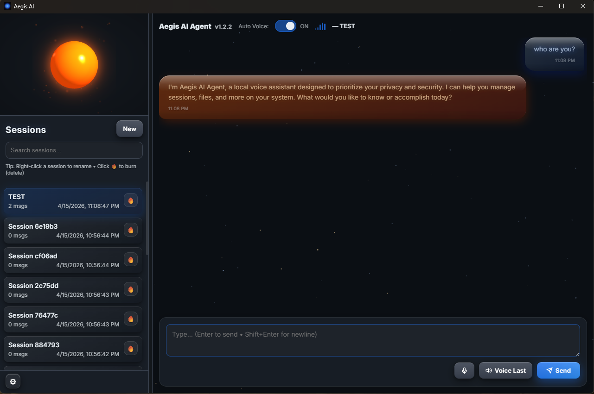

# Aegis AI Agent — Local Voice Agent


A locally-running AI voice agent with an agentic tool loop, sandboxed filesystem access, and a native desktop UI. All inference runs on-device via Ollama — no cloud APIs, no subscriptions.



## What's New in v1.2.2

- **Native desktop app** — Tauri window with a 3D Babylon.js voice orb, audio-reactive pulse, and starfield background
- **Voice I/O** — Kokoro TTS speaks every reply; mic VAD detects speech automatically
- **Glassy chat bubbles** — Glassmorphism bubbles with directional tails, backdrop blur, and per-message timestamps
- **Session sidebar** — Persistent named sessions with search, rename, and burn (delete), with its own independent scroll

## Features

- **Voice I/O** — Kokoro TTS (neural, on-device) speaks every reply. Auto Voice toggles it on/off per session.
- **Agentic loop** — the LLM calls tools (read/write files, run shell commands, propose/apply patches, search sessions) up to a configurable iteration limit
- **Tool call timeline** — each tool invocation renders as a collapsible card in the chat so you can see exactly what the agent did
- **Session management** — persistent named sessions with search, rename, and burn (delete)
- **Settings panel** — cog icon in the sidebar lets you switch voices live (no restart needed)
- **Guardrails** — filesystem access sandboxed to configurable roots; byte limits and process timeouts enforced
- **MCP-compatible tool schema** — `GET /api/tools/mcp` exports all tools in Model Context Protocol format, compatible with Claude, Cursor, and other MCP hosts
- **Eval harness** — `POST /api/eval` runs a built-in benchmark suite and scores the tool layer
- **Docker support** — one-command deploy with Ollama as a sidecar

## Stack

| Layer | Technology |
|---|---|
| API server | FastAPI + Uvicorn |
| LLM backend | Ollama (default: `llama3.1:8b`) |
| Text-to-speech | Kokoro TTS (Apache 2.0, fully local) |
| Python | 3.12+ |

## Quick Start

```powershell
# Clone and enter the project
git clone <repo-url>
cd AegisAgent

# One-command setup (creates .venv, installs all deps)
.\setup.ps1

# Start Ollama (separate terminal)
ollama serve

# Run Aegis
.\run.ps1

# Open http://127.0.0.1:8000/ui
```

## Docker

```powershell
docker compose up --build
# Open http://127.0.0.1:8000/ui
# Pull a model: docker compose exec ollama ollama pull llama3.1:8b
```

## Configuration

Copy `.env.example` to `.env` and adjust. All settings have safe defaults — no configuration required to run.

| Variable | Default | Description |
|---|---|---|
| `OLLAMA_CHAT_URL` | `http://127.0.0.1:11434/api/chat` | Ollama API endpoint |
| `OLLAMA_MODEL` | `llama3.1:8b` | Model to use |
| `KOKORO_VOICE` | `af_heart` | TTS voice (`af_heart`, `af_bella`, `am_adam`, `bf_emma`, `bm_george`) |
| `KOKORO_GPU` | `0` | Set to `1` to use GPU for TTS |
| `KOKORO_PREWARM` | `0` | Set to `1` to load TTS model at startup |
| `AEGIS_MODE` | `semi` | `semi` = approval required for risky tools, `auto` = fully autonomous |
| `AGENT_MAX_ITERS` | `5` | Max tool-call iterations per turn |
| `AEGIS_ALLOWED_ROOTS` | project root | Semicolon-separated paths the agent can access |

## API

| Endpoint | Method | Description |
|---|---|---|
| `/ui` | GET | Browser interface |
| `/api/chat` | POST | Send a message, get a reply |
| `/api/sessions` | GET | List all sessions |
| `/api/tools/mcp` | GET | Tool schemas in MCP format |
| `/api/eval` | POST | Run eval harness, get scored results |
| `/api/settings` | GET/POST | Read or update runtime settings (e.g. voice) |
| `/health` | GET | Server health and ready state |

## Architecture

```
app.py                  # FastAPI app, agent loop, all endpoints
aegis_core/
  config.py             # Settings via environment variables
  guardrails.py         # Path sandboxing and access control
  tools.py              # ToolDef dataclass and permission levels
  tools_registry.py     # Tool registry, system prompt, MCP export
  scanner.py            # Project version/pattern scanner
  patch_engine.py       # Unified diff patch application
evals/
  tasks.json            # Benchmark task definitions
  runner.py             # Eval harness — runs tasks, scores results
  results.json          # Latest eval output (auto-generated)
static/
  index.html            # Browser UI
Dockerfile              # Container build
docker-compose.yml      # Aegis + Ollama services
setup.ps1               # One-command local setup
run.ps1                 # Start the server
```

## Voices

Kokoro TTS voices are built-in — no reference audio needed.

| Voice ID | Description |
|---|---|
| `af_heart` | American Female — warm (default) |
| `af_bella` | American Female — brighter |
| `am_adam` | American Male |
| `bf_emma` | British Female |
| `bm_george` | British Male |

Switch voices live via the ⚙ settings panel in the sidebar, or set `KOKORO_VOICE` in `.env`.
